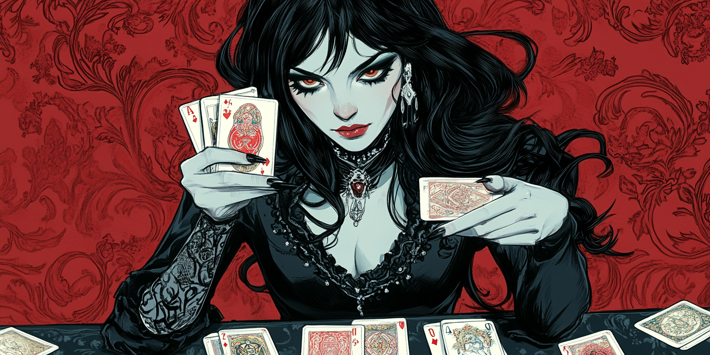
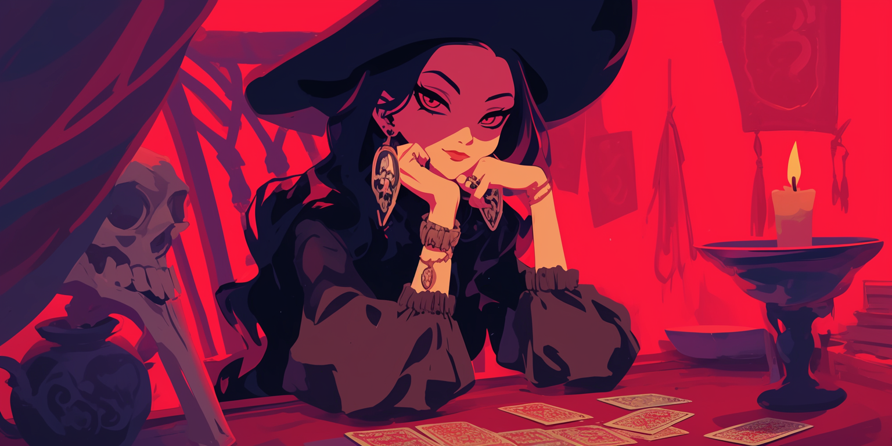

<body>

<h1>🔮 The Tarot Machine – Project 6 of The Code Fool's Journey</h1>

<h2>Overview</h2>

<h3>Situation</h3>

What if your terminal could whisper back the secrets of your subconscious? <strong>The Tarot Machine</strong> is a mystical terminal-based program that simulates a symbolic tarot reading. By choosing a card spread and asking a question, users receive randomized tarot cards that come with keywords to inspire reflection and insight. This project was designed to practice <strong>functions</strong> and <strong>loops/output</strong>.

<h3>Task</h3>

The goal was to create an interactive tarot experience where users choose different types of card spreads — from a single card to a three-card combo. Each card is randomly drawn from themed categories like Major Arcana, Minor Arcana, and Court Cards. The user can repeat the reading as many times as desired, or end the game, recieving an inspiring message.

<h3>Action</h3>

I designed the user experience to feel like a ritual, with thematic messages and symbolic feedback. The program uses <strong>loops</strong> to handle repeat interactions and input validation, a main <strong>function</strong>, and conditional operators.

<h3>Result</h3>

The result is an artistic terminal application that allows programmers to reflect while practicing key coding concepts. The Tarot Machine shows how even simple programming concepts can be turned into meaningful symbolic experiences.

<h2>Multi-Language Learning Philosophy</h2>

Just like the first project, this one is being developed in Python, JavaScript, and C++. I’m studying these three languages simultaneously to avoid becoming too attached to the quirks of just one. This method helps me grasp the core logic of programming — which is universal across languages — rather than memorizing syntax. By rewriting the same project in multiple languages, I reinforce my understanding of structures, variables, functions, and flow — while also appreciating the expressive power of each language.

<h2>Project Scope: The Tarot Machine</h2>

Core concepts covered (in addition to concepts from previous projects):

<ul>
  <li>Functions (while)</li>
</ul>

<h1>About the Code Fool's Journey</h1>

The Fool's Journey is similar to Joseph Campbell’s famous Hero’s Journey, but instead of 12 stages, it follows 22 stages, based on the 22 Major Arcana of the Tarot. Each card represents an archetype in the evolution of the protagonist, the Fool, who embarks on a path toward knowledge and personal power, just like programmers and artists. Here, each project increases in complexity and covered concepts, from simple variables and data types to APIs, Memory Management, Databases and GUI.

<h1>Feel Free to Fork the Journey</h1>

If you find this helpful for learning or teaching, you're welcome to fork, improve, or remix it in your own way. The Fool’s path is yours to walk — and code — however you like.😊

</body>
